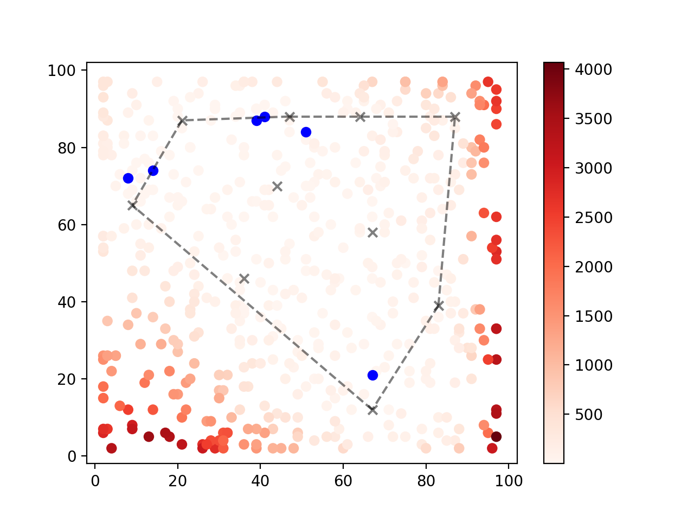
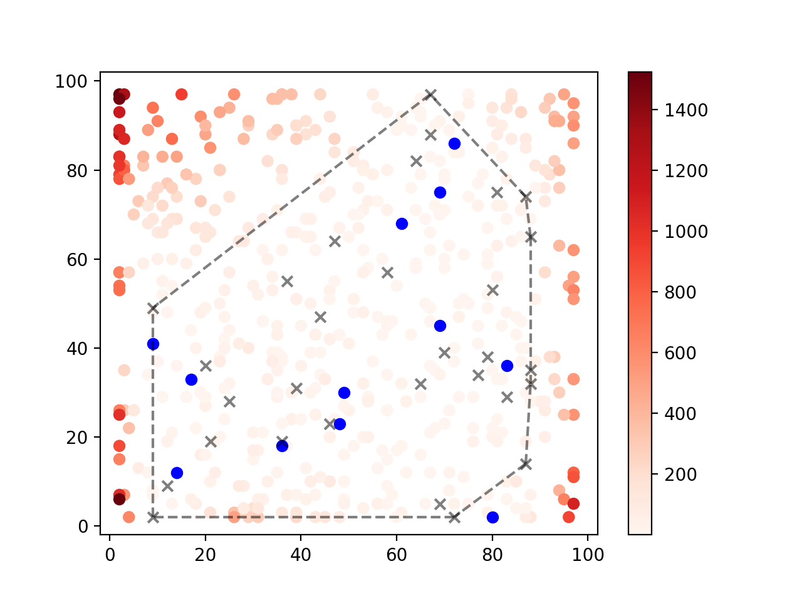

## Implicit Behavior Cloning - PyTorch (wip)

Pytorch implementation of <a href="https://arxiv.org/abs/2109.00137">Implicit Behavior Cloning</a>.

## Install

```bash
conda create -n ibc python=3.8
pip install -r requirements.txt
```

## Progress

* [x] Implement the coordinate regression task.
* [x] Implement an explicit policy.
* [x] Generate plot like in Figure 4.
* [ ] Implement an implicit EBM model.

## Results

|             | Explicit Policy | Implicit Policy |
|-------------|-----------------|-----------------|
| 10 examples ||                 |
| 30 examples ||                 |

## Citation

```bibtex
@misc{florence2021implicit,
    title = {Implicit Behavioral Cloning},
    author = {Pete Florence and Corey Lynch and Andy Zeng and Oscar Ramirez and Ayzaan Wahid and Laura Downs and Adrian Wong and Johnny Lee and Igor Mordatch and Jonathan Tompson},
    year = {2021},
    eprint = {2109.00137},
    archivePrefix = {arXiv},
    primaryClass = {cs.RO}
}
```
