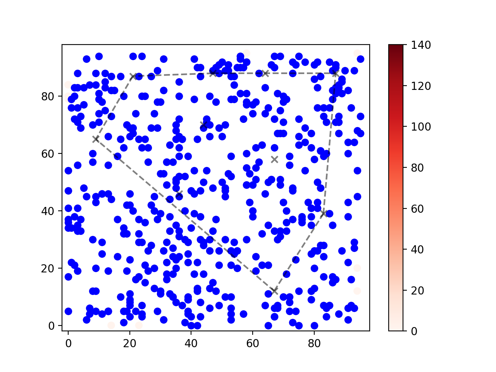
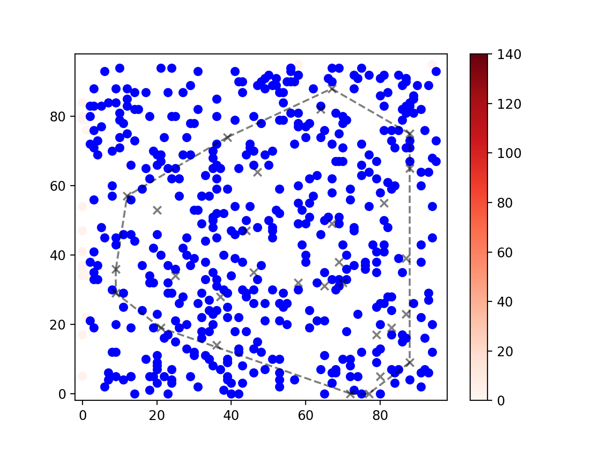

## Implicit Behavioral Cloning - PyTorch

Pytorch implementation of <a href="https://arxiv.org/abs/2109.00137">Implicit Behavioral Cloning</a>.

## Install

```bash
conda create -n ibc python=3.8
pip install -r requirements.txt
```

## Results

To reproduce results from the Coordinate Regression Task (Section 3), execute the `run_explicit.sh` and `run_implicit.sh` scripts. Note that the implicit policy does a tad bit worst with 30 examples than 10. Not entirely sure why that is the case and need to investigate more.

|             | Explicit Policy | Implicit Policy |
|-------------|-----------------|-----------------|
| 10 examples |||
| 30 examples |||

## Citation

If you find this code useful, consider citing it along with the paper:

```bibtex
@software{zakka2021ibc,
    author = {Zakka, Kevin},
    month = {10},
    title = {{A PyTorch Implementation of Implicit Behavioral Cloning}},
    url = {https://github.com/kevinzakka/ibc},
    version = {0.0.1},
    year = {2021}
}
```

```bibtex
@misc{florence2021implicit,
    title = {Implicit Behavioral Cloning},
    author = {Pete Florence and Corey Lynch and Andy Zeng and Oscar Ramirez and Ayzaan Wahid and Laura Downs and Adrian Wong and Johnny Lee and Igor Mordatch and Jonathan Tompson},
    year = {2021},
    eprint = {2109.00137},
    archivePrefix = {arXiv},
    primaryClass = {cs.RO}
}
```
